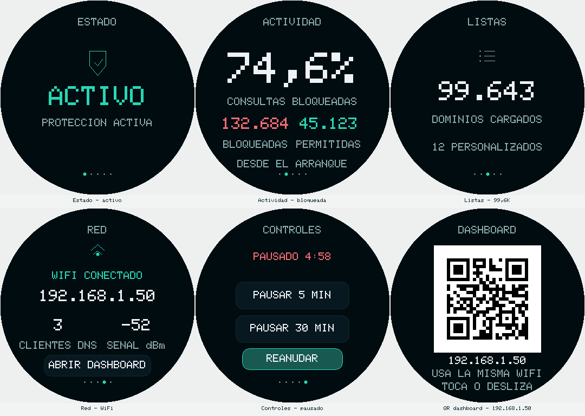
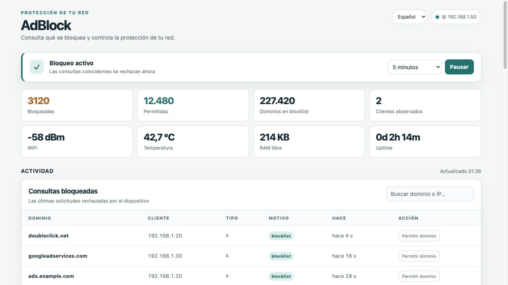
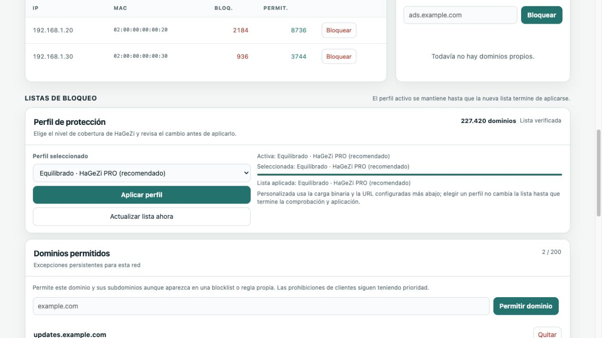
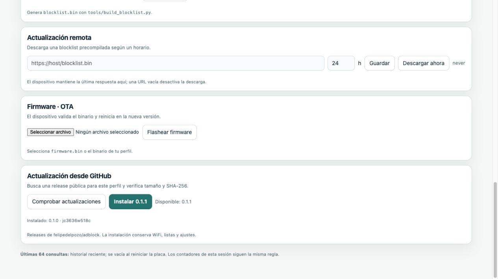

# ESP AdBlock Round — ESP32 & ESP32-S3 DNS Ad Blocker

[](https://github.com/felipedelpozo/adblock/actions/workflows/firmware.yml)
[](https://github.com/felipedelpozo/adblock/releases/latest)
[](LICENSE)

An open-source **ESP32 DNS sinkhole** for network ad and tracker blocking, with
a local web dashboard and optional round touchscreen. Run it on an ESP32-C3
or ESP32-S3, point a device's DNS at it, and manage blocking from your browser.

**[Download v0.1.1](https://github.com/felipedelpozo/adblock/releases/tag/v0.1.1)**
· [Setup](#getting-started) · [Hardware & pinout](#hardware-profiles)
· [Firmware updates](#ota-and-persistent-updates) · [FAQ](#faq)

An adaptation of [M-Abozaid/esp32-c3-adblock](https://github.com/M-Abozaid/esp32-c3-adblock)
(upstream `c56456ac535844d9eecd6cfee030a2e23dc797d1`). The same DNS sinkhole,
web dashboard, browser/Arduino OTA, captive portal, persistent client bans and
custom domains, and scheduled blocklist updates run in all hardware profiles.

The primary tested board is the **Guition JC3636W518C**, stock SW V0.9.1:
**ESP32-S3, 16 MB flash, 8 MB OPI PSRAM**, a **1.8-inch ST77916 QSPI 360×360**
display and **CST816** touch. The original headless C3 and a separate C3 round
display profile are also supported. Select the exact hardware profile below.

DNS blocking reduces ads and tracking but cannot reliably remove YouTube ads
served from the same domains as video. Administration is intended for a trusted
LAN; see [security and limitations](SECURITY.md).

## Features

- **DNS ad blocking:** flash-based domain hashes, parent-domain matching,
  custom domain rules and persistent client bans.
- **Curated blocklists:** HaGeZi Light / PRO / PRO++ profiles, verified GitHub
  list updates and persistent allowed-domain exceptions.
- **Local dashboard:** live counters, observed clients and a searchable history
  of the last 64 blocked queries; no cloud account or external web assets.
- **Round touch UI:** five swipe pages for status, activity, lists, network and
  controls; pause for 5/30 minutes or resume, and scan a local dashboard QR.
- **Verified GitHub OTA:** confirm a compatible release, then verify HTTPS,
  image size, SHA-256 and embedded board/profile/version identity before reboot.
- **Low-memory display:** LovyanGFX, incremental 8-row stripes and no full-screen
  framebuffer; Wi-Fi provisioning uses a captive portal.
- **One codebase:** headless C3/S3, GC9A01 240×240 and ST77916 QSPI 360×360 profiles.

## Screenshots

### Round display



360×360 display views generated from the firmware drawing code with example
data. See [display preview provenance](docs/images/DISPLAY_PREVIEWS.md) for the
host-rendering method and physical-panel differences.

### Web dashboard and blocked-query history



### HaGeZi profiles and allowed domains



### Firmware updates from GitHub Releases



Dashboard images are browser captures of the firmware HTML served with
synthetic data: addresses, counters and history entries are examples.
[Reproduce the captures](docs/images/README.md).

## Getting started

1. Clone this repository and install the build tools below.
2. Identify the chip, flash and board before selecting a profile. Back up the
   existing flash and check its partition layout before a first USB install.
3. Build firmware and generate a blocklist. Follow the flashing instructions;
   use filesystem upload only for a verified empty initial filesystem.
4. Join `C3-AdBlock-XXXX` if needed and provision Wi-Fi at `http://192.168.4.1/`.
5. Open `http://c3adblock.local/` or the device IP. Upload a blocklist through the
   dashboard if it is not already installed.
6. Reserve the device's IP in router DHCP. Test one client first, then advertise
   that IP as your LAN DNS resolver. A second public resolver can bypass blocking;
   browser encrypted DNS and IPv6 resolver settings can also bypass it.

```sh
git clone https://github.com/felipedelpozo/adblock.git
cd adblock
```

Application binaries are available in
[Releases](https://github.com/felipedelpozo/adblock/releases). Choose the exact
hardware profile; these files are **application-only OTA images**. A first
installation requires the source build, compatible partition layout and
separate blocklist setup described below.

## Hardware profiles

| Environment | Hardware | Display | Flash |
|---|---|---|---|
| `jc3636w518c` (default) | Confirmed Guition S3 | ST77916 QSPI, 360×360, CST816 | 16 MB |
| `s3-headless` | Same S3, network services only | None | 16 MB |
| `c3` | Original ESP32-C3 | None | 4 MB |
| `round-display` | ESP32-2424S012C | GC9A01 SPI, 240×240, CST816 | 4 MB |

The C3 display profile is compile-verified only; no such board was connected.
USB identifies the chip and flash, not the PCB or LCD pinout. Never select a
profile by USB vendor ID alone. The JC pinout was checked against the supplied
model, factory firmware controller strings, manufacturer demo and schematics
in [td0034/JC3636W518](https://github.com/td0034/JC3636W518) and the independent
[itoulee/jc3636w518-demo](https://github.com/itoulee/jc3636w518-demo).

| Function | JC3636W518C S3 | ESP32-2424S012C C3 |
|---|---:|---:|
| LCD clock | 9 | 6 |
| LCD CS | 10 | 10 |
| LCD D0 / MOSI | 11 | 7 |
| LCD D1 / D2 / D3 | 12 / 13 / 14 | — |
| LCD DC | QSPI command phase | 2 |
| LCD reset | 47 | Unconnected |
| Backlight | 15 | 3 |
| Touch SDA / SCL | 7 / 8 | 4 / 5 |
| Touch reset / interrupt | 40 / 41 | 1 / 0 |
| Touch I²C address | 0x15 | 0x15 |
| BOOT | 0 | 9 |

## Screen and touch

LovyanGFX draws directly to the display: no LVGL, sprite or full-screen
framebuffer. A shared logical 240×240 layout scales to 360×360. Horizontal
swipes navigate five circular pages, wrapping at either end:

| Page | Information / actions |
| --- | --- |
| Status | Large active/paused state and remaining pause time |
| Activity | Blocking percentage, blocked and allowed query counts |
| Lists | Loaded blocklist domains and custom domain count |
| Network | Wi-Fi/portal status, IP, observed DNS clients, RSSI and dashboard QR |
| Controls | Large 5-minute / 30-minute pause buttons and conditional resume |

Swipe left for the next page, right for the previous page. Five dots at the
bottom indicate position. The device starts on Status after reboot. Labels
are in Spanish, following the approved design. Touch actions fire on release,
on Controls and the Network dashboard button; a swipe that starts on a button
does not press it.
On Network, tap **ABRIR DASHBOARD** to display a QR linking to the device's
current `http://IP/` address. Scan it from a phone on the same Wi-Fi (or the
device AP during setup). Tap or swipe once to return to Network. This gesture
only dismisses the QR; it does not navigate or press another control. The QR
closes if the device loses its connection and updates if its IP changes.
The QR uses LovyanGFX's existing encoder, a 79-byte cached bit matrix and a
four-module white quiet zone. It contains no credentials. Rendering remains
incremental and uses no framebuffer.
Pauses are deliberately volatile and start ACTIVE after a restart; they
share the exact same state as the web controls. Existing per-client bans
remain enforced while domain blocking is paused.

Only changed regions redraw, clipped to one 8-row logical stripe per main-loop pass. State is
sampled every 250 ms. Touch polling is bounded, checks the CST816 chip ID and
tracks coordinates throughout contact, then distinguishes taps from horizontal
swipes. Vertical drags, long presses and interrupted contacts produce no action.
Control taps are ignored until the new page has finished its initial repaint.
Portal mode shows its AP name and IP; touch
pause commands have no effect until network services are running. Serial logs
include controller ID, touch coordinates/actions, heap and maximum render time.

See [the five-page validation report](docs/DISPLAY_SWIPES_VALIDATION.md) for
the installed firmware, test results and physical checks.

Main integration is in `src/main.cpp`; display, UI and touch are separate
modules. `src/touch_model.h` contains the allocation-free gesture recognizer;
`src/ui_model.h` shares page order and exact button rectangles with the renderer
and native tests. `src/display_qr.*` caches the QR matrix and
`src/dashboard_link.h` validates and formats its local URL.
`boards/jc3636w518c.json` defines the actual 16 MB/8 MB board;
`src/st77916_qspi.*` supplies the QSPI transport absent in LovyanGFX 1.2.7. `src/blocking_state.h` handles duration limits and clock rollover.

## Recent blocked-query history

The dashboard now includes a searchable, paginated history of the **last 64
blocked DNS requests**, newest first: requested domain, client IP, DNS type,
reason (blocklist, custom domain or banned client), and elapsed time. History
uses approximately 17 KiB of fixed RAM in every profile and is cleared on
reboot. The DNS capture path does not allocate memory or write to flash.
Allowed requests are not logged.

`GET /blocked.json?offset=0&limit=16&q=example` returns up to 16 entries per
page. Search matches domains and client IPs without case sensitivity and is
limited to 63 characters. All DNS bytes are escaped before JSON serialization;
the browser displays received strings as text. No external assets are needed.

The round display separates status, activity, lists, network and controls.
Only the visible page's changing regions redraw. A round robin repaint schedule
prevents continuously changing statistics from delaying other regions.
Rendering remains clipped to eight logical rows, without a full-screen
framebuffer; changing pages cancels the previous page's pending paint work.

Run `python tools/verify_history.py DEVICE_IP` to check the live history. This
deliberately generates 80 blocked queries and replaces the volatile recent
history; it does not modify persistent settings. DNS blocking cannot reliably
remove YouTube advertisements served from domains shared with video content.

## Build and tests

Install Python 3.12+ and PlatformIO in a virtual environment:

```sh
python3 -m venv .venv
. .venv/bin/activate
python -m pip install platformio==6.1.19 esptool pyserial
pio run -e jc3636w518c
pio run -e c3 -e round-display -e s3-headless
pio test -e native
python -m unittest discover -s tests -v
node --test tests/test_dashboard_*.cjs
```

Node.js 22+ runs the dashboard unit tests; Python/PlatformIO build the firmware.
No `secrets.h` is required. Saved NVS credentials take precedence; otherwise
use the captive portal. Optional compile-time credentials follow
`src/secrets.example.h`; `src/secrets.h` is ignored by Git.

Build a blocklist from StevenBlack and HaGeZi Light:

```sh
mkdir -p data
python tools/build_blocklist.py data/blocklist.bin
```

The HaGeZi default uses the current `wildcard/light-onlydomains.txt` path.
A failed source or empty list stops the build and preserves the old output.
The result is sorted unique 40-bit FNV-1a hashes, matching the original engine.

Firmware 0.2.0 also offers **Ligero**, **Equilibrado** (recommended) and
**Estricto** directly in the dashboard. Existing installations retain their
current list as **Personalizada** until a profile is explicitly applied.
Allowed-domain exceptions cover subdomains and survive reboot/OTA. They
override domain blocks, while client bans remain enforced. See
[blocklist profiles, distribution and licensing](docs/BLOCKLIST_PROFILES.md).

## Identify, back up and flash

Read-only chip/flash identification must come before firmware writes:

```sh
python -m serial.tools.list_ports -v
esptool --port /dev/cu.usbmodem83201 chip-id
esptool --port /dev/cu.usbmodem83201 flash-id
esptool --port /dev/cu.usbmodem83201 read-flash 0 ALL original-flash.bin
```

Backups can contain private settings; keep them outside the repository.
Do not run `erase-flash`. Firmware upload preserves NVS and the filesystem
provided their partition offsets match the device:

```sh
pio run -e jc3636w518c -t upload --upload-port /dev/cu.usbmodem83201
pio device monitor --port /dev/cu.usbmodem83201 --baud 115200
```

On this device the original factory `ffat` region at `0x410000`, size
`0xbe0000`, was checked in the complete backup and contained only `0xff`.
`partitions-s3.csv` preserves original NVS, both 2 MB OTA slots and coredump,
relabeling that erased region for LittleFS (11.875 MiB). The C3 partition table
is unchanged. LittleFS never auto-formats on mount failure.

**Only for a verified empty initial filesystem**, upload the generated list:

```sh
pio run -e jc3636w518c -t uploadfs --upload-port /dev/cu.usbmodem83201
```

`uploadfs` replaces the whole filesystem. On an already configured device,
use the dashboard's Blocklist Upload instead so custom domains, bans and
update settings are retained. The SD card and audio/media files are unused
and untouched by this project.

## Wi-Fi and live checks

If no saved Wi-Fi connects, join the open AP `C3-AdBlock-XXXX` and open
`http://192.168.4.1`. Enter the network and password in the captive portal.
After reboot, the serial monitor reports the station IP. BOOT requests the
portal without deleting saved credentials; `/forgetwifi` remains an explicit
credential reset in the upstream web interface.

Open `http://c3adblock.local` or the reported IP. Point test devices/router
DNS at that IP. Use it as the only advertised resolver when you want blocking:
a second public DNS server can bypass the sinkhole.

```sh
python tools/verify_device.py DEVICE_IP
# Or individual DNS queries:
dig @DEVICE_IP doubleclick.net
dig @DEVICE_IP example.org
```

The live check validates the dashboard, sinkhole, parent-domain matches,
upstream resolution, web pauses and resume, then restores the initial pause
state. Physical screen visibility and actual touch presses still require
observation on the device; successful initialization alone is not visual proof.

## OTA and persistent updates

The dashboard can check stable releases from
[felipedelpozo/adblock](https://github.com/felipedelpozo/adblock). Click
**Comprobar actualizaciones**, then **Instalar VERSION** and confirm when a
new compatible release is available. The device downloads it over validated
HTTPS and checks the profile, embedded identity, size and SHA-256 before
activating its inactive OTA slot. Wi-Fi, settings and LittleFS are retained.
No releases means no installation; updates are never installed automatically.
See [GitHub update and release instructions](docs/GITHUB_FIRMWARE_UPDATES.md)
for the manifest contract, publishing the six release assets and CI builds.
See the [latest v0.1.1 release validation](docs/RELEASE_VALIDATION_0.1.1.md)
for published-asset checksums and the physical OTA/device evidence. The
[pre-release GitHub and QR validation](docs/GITHUB_QR_VALIDATION.md) remains as
historical preparation evidence; optical phone-camera QR scanning is still
pending.

Upload `.pio/build/jc3636w518c/firmware.bin` through the dashboard Firmware
section, or use Arduino OTA:

```sh
pio run -e jc3636w518c -t upload --upload-port c3adblock.local
```

PlatformIO automatically selects espota when the upload port is an IP address or hostname.
Use the same hardware environment for OTA. Browser OTA writes the inactive
app slot; firmware updates preserve NVS/LittleFS. Blocklist uploads and remote
scheduled updates validate a staged file before replacing the active list.
Downloads keep the old list available. Insufficient staging space, truncated
downloads and invalid hashes are rejected without deleting it. Custom domains
continue working even when no flash blocklist has been installed.

The upstream synchronous DNS forwarder may wait up to one second for an
unresponsive upstream. Remote list downloads use a separate worker.
The display adds no background task or framebuffer. GitHub firmware downloads
use a separate worker that yields between writes; DNS burst handling has a
10 ms fairness bound between queries, but an individual upstream timeout can
still delay UI/web. The upstream dashboard/OTA are unauthenticated and intended
for a trusted LAN; never expose them to the public Internet.

## Upstream and license

The original README is preserved in [docs/UPSTREAM_README.md](docs/UPSTREAM_README.md).
Original project by M-Abozaid, inspired by s60sc/ESP32_AdBlocker. The engine is MIT,
see [LICENSE](LICENSE); the vendor display table carries Apache-2.0 attribution
in [licenses/NOTICE.md](licenses/NOTICE.md).

See [CONTRIBUTING.md](CONTRIBUTING.md), [CHANGELOG.md](CHANGELOG.md) and the
[release checklist](docs/RELEASING.md) for development and maintenance.

## FAQ

### Is this an ESP32 alternative to Pi-hole?

It provides Pi-hole-style DNS sinkhole blocking on a microcontroller, with
fewer features and less capacity than a Raspberry Pi/server deployment. It
uses the original ESP32 AdBlock engine; it is an independent project.

### Does it block YouTube ads?

DNS filtering cannot distinguish ads from videos served on the same domain.
Blocking such domains can break playback. Use a browser/content blocker where
DNS filtering is insufficient.

### Will it protect every device on my network?

Only clients that use this device as their DNS resolver are filtered. Router
DHCP DNS settings are a convenient way to distribute its reserved IP. Public
secondary DNS, browser DNS-over-HTTPS, VPN resolvers and separate IPv6 DNS can
bypass it. Start with one client before changing router settings.

### Does it need a cloud service or PSRAM?

Administration is local. The C3 profiles run with 4 MB flash and no PSRAM; the
tested JC3636W518C has 16 MB flash and 8 MB PSRAM. Blocklist downloads and GitHub
firmware updates use the Internet when requested/configured.

### Can firmware updates erase my Wi-Fi or blocklist?

Compatible application-only OTA updates preserve NVS and LittleFS. A full
flash erase, changed partition layout or filesystem upload can replace saved
data; back up before a first USB installation or migration.

### What hardware has been physically tested?

The Guition **JC3636W518C** with **ST77916** display and **CST816** touch. The
ESP32-C3 headless/GC9A01 profiles are compile-verified; see the validation
reports for the exact scope of device and QR checks.
