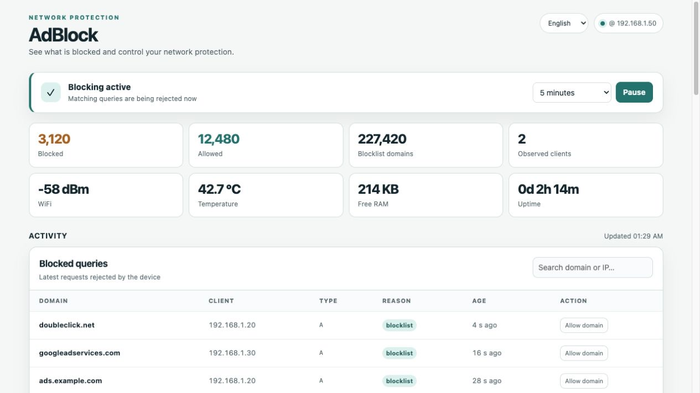
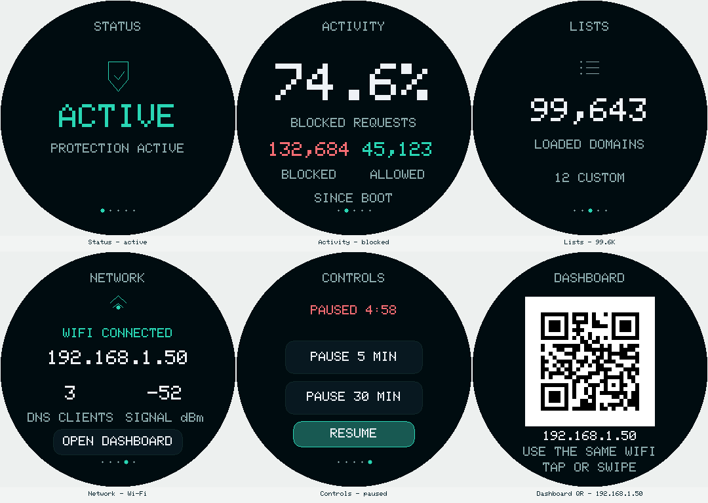

# Appliance languages

The current source/local firmware build is **0.2.4**. It includes Spanish
(`es`, the default) and English (`en`). Select **Español / English** at the
top of the dashboard. The choice applies to the
device, including other browser tabs, all round-display pages and QR view,
and the Wi-Fi provisioning portal. Switching language does not restart the
device or change DNS configuration, lists, exceptions, or credentials.
The portal also has its own **Español / English** selector, so the first
network setup is available in either language before dashboard access.





These previews use example data. The display image is a host render, not a
photograph; see [display previews](images/DISPLAY_PREVIEWS.md). Native browser
file-picker controls follow the browser/OS language independently.

The preference is stored separately as the NVS `ui/language` value and read
before initializing the display. It survives restart and compatible OTA.
An absent or unsupported stored value falls back to Spanish. No external
translation service, web assets or extra production libraries are required.

## API and security

`GET /stats.json` and `GET /lists.json` expose the active `language` code.
`POST /language?lang=en` (or `es`) requires the existing per-boot dashboard
nonce in `X-CSRF-Token` plus the matching dashboard `Origin`. Unsupported
codes return HTTP 400, invalid authorization returns 403, and storage failure
returns 500. A successful response returns `{ "language": "en" }` after
verifying the stored preference. Repeating the current choice avoids an NVS
write. Wi-Fi passwords and data files are unaffected.

During provisioning, `POST /wifi/language` uses the portal's `csrf` hidden
field and matching Origin. It redirects to the localized form after saving;
the device stays in setup. It refuses a language change while an association
or an imminent reboot is in progress. `/wifi/status` includes `language` so
other portal tabs can refresh their copy.

The dashboard polls the device language and keeps form drafts intact.
Network-provided data (domains, IPs, SSIDs and firmware versions) stays data,
not translated markup. Backend update statuses use explicit templates; an
unknown diagnostic remains unchanged rather than being guessed.

The display continues using clipped incremental stripes. A locale change
invalidates its visible content and repaints without allocating a full-screen
framebuffer or moving to another swipe page.

## Validation

```sh
pio test -e native
node --test tests/test_dashboard_*.cjs
pio run -e c3 -e round-display -e s3-headless -e jc3636w518c
python tools/verify_language.py DEVICE_IP
# Optional, intentionally reboots and temporarily enters/cancels Wi-Fi setup:
python tools/verify_language.py DEVICE_IP --reboot-port SERIAL_PORT --exercise-portal
```

The live verifier restores the initial language, uses no real replacement
network credentials, and checks that existing lists/settings survive. For
documentation previews use `tools/preview_dashboard.py --language en`.
See [validation results](LANGUAGE_VALIDATION.md) for build and live-device evidence.

To extend the supported languages, add an explicit code to the native locale
model, update the dashboard catalog/selector, display and portal strings, and
backend status templates, then run all profile builds and layout checks.
