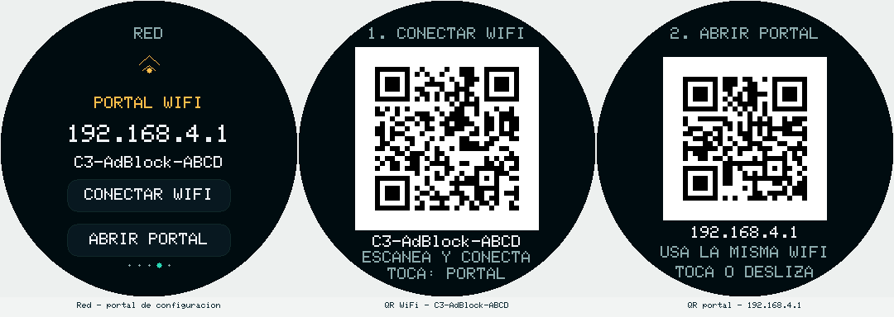

# Wi-Fi setup module

`wifi_setup` owns station credential selection and the temporary C3 AdBlock
configuration portal. `begin()` receives the compile-time fallback, then
`connect()` tries the new `wifi_setup/record` NVS blob first, the legacy
`wifi/ssid` and `wifi/pass` keys second, and the fallback last. Legacy values
are read without deleting or rewriting them.

The replacement record is a fixed, versioned, checksummed blob. A submitted
network is associated while the AP remains available in `WIFI_AP_STA` mode;
only a successful association followed by a verified blob write changes the
stored configuration. Invalid input, a failed 20-second attempt, and a
cancelled portal leave the previous record untouched. After success the device
reboots following an eight-second message. Cancellation restarts a configured
device after one second; ten minutes without a form interaction also returns
it to the saved network. Status polling does not extend this timeout. An
unconfigured device remains in setup and can retry after cancellation.

The AP keeps the established `C3-AdBlock-XXXX` name and serves at
`http://192.168.4.1`. The form uses an unpredictable per-boot `csrf` hidden
field. The same field is required on `POST /wifisave` and `POST /wifi/cancel`;
when an `Origin` header is present it must be the AP address, the connected
LAN address, or `http://c3adblock.local`. `GET /wifi/status` returns only
state, AP address, and (after success) the new station IP and mDNS name; it
never returns a password. Scanned SSIDs are HTML escaped before entering the
`<datalist>`.

## Connect from a phone using the display

In firmware 0.2.4 and newer, entering setup automatically shows the round
display's **1. CONNECT WIFI / 1. CONECTAR WIFI** QR. Scan it with the phone's
camera or Wi-Fi QR scanner and confirm joining `C3-AdBlock-XXXX`. This is
the existing open configuration AP, so no password is included. The phone
may report that the network has no Internet; remain connected to configure
the appliance. Captive-portal opening depends on the phone.

Tap the display to show **2. OPEN PORTAL / 2. ABRIR PORTAL**, then scan that
URL QR to open `http://192.168.4.1/` if needed. Enter the desired 2.4 GHz
network and its password in the portal. A swipe dismisses a QR without
triggering another action. On the Network page, **CONNECT WIFI** and
**OPEN PORTAL** reopen the respective QR views during setup.

The first QR follows the standard `WIFI:T:nopass;S:C3-AdBlock-XXXX;;` payload.
It uses the current setup AP name; it never reads or encodes saved station
passwords. Version 3 / medium correction accommodates the Wi-Fi payload;
the existing URL QR remains version 2 / medium correction. One packed
matrix cache grows from 79 to 106 bytes. Both use four white quiet modules
and the existing clipped stripe renderer, with no full display framebuffer.
See [setup QR validation](SETUP_WIFI_QR_VALIDATION.md) for build and hardware scope.



The image uses demonstration data. Scan the actual display's QR, which contains
your device's own AP name.

`POST /wifi/setup` belongs to the normal dashboard. It requires the existing
boot nonce in `X-CSRF-Token` plus the dashboard Origin and refuses competing
list/firmware operations. It schedules a reboot with a one-shot flag rather
than deleting credentials. The old `/forgetwifi` route returns HTTP 410.
Portal form submissions redirect with HTTP 303 to the live status page;
failed connections remain visible until the user retries or cancels.

`consumeSetupRequest()` consumes the one-shot `wifi_setup/setup_req` flag and
retries on a later boot if its clearing write cannot be verified.
`requestSetup()` verifies the NVS write before reporting success. Neither
function formats LittleFS or erases existing preferences.

## Native verification

The platform-independent validation and record codec are covered by:

```text
../../work/tooling/bin/pio test -e native -f test_wifi_setup_model
```

The focused suite covers SSID/password byte bounds, open networks, spaces,
control/NUL rejection, round trips, checksum mutation, and truncated records.

## Live verification

```sh
python tools/verify_wifi_setup.py DEVICE_IP
# Temporarily stops blocking and verifies a failed attempt, cancel and recovery:
python tools/verify_wifi_setup.py DEVICE_IP --exercise-portal
```

The script neither reads a saved password nor submits real replacement
credentials. It deliberately tries a randomly named nonexistent open network
and checks that Wi-Fi, lists, exceptions and settings survive the return to
normal operation. See the [historical local 0.2.2 validation](WIFI_SETUP_VALIDATION.md);
the current source/local build is 0.2.4 and remains pending a firmware release.
